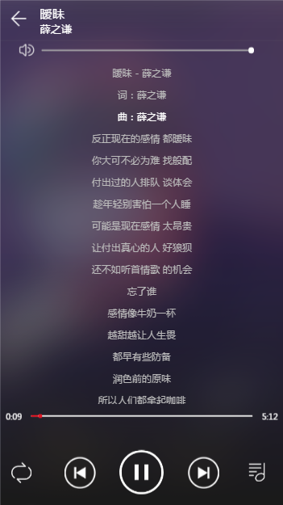

# vue2_test

>采用vue2.0制作的音乐播放器 vue2.0 + vuex + vue-router

>数据是从接口获取的,不是死数据

#预览

[在线预览](https://zhangyuxin777.github.io/Vue2_music_player/dist/index.html#/)

```img

         


        
```


## Build Setup

``` bash
# install dependencies
npm install

# serve with hot reload at localhost:8080
npm run dev

# build for production with minification
npm run build

# build for production and view the bundle analyzer report
npm run build --report

# run unit tests
npm run unit

# run e2e tests
npm run e2e

# run all tests
npm test
```

For detailed explanation on how things work, checkout the [guide](http://vuejs-templates.github.io/webpack/) and [docs for vue-loader](http://vuejs.github.io/vue-loader).

